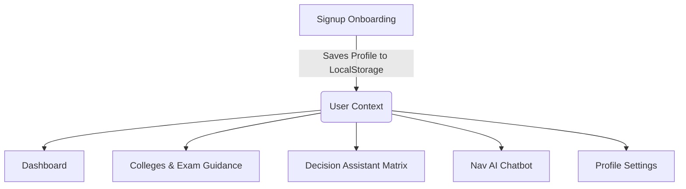

# NavGuide - AI Educational Mentor: Feature Documentation & Replication Guide

NavGuide is a premium, AI-powered educational mentor application designed to help students track their education, improve skills, choose career paths, and match with colleges/entrance exams. 

If you are planning to add these features to another website, this document provides the complete list of features, underlying algorithms, state management logic, and step-by-step instructions for replication.

---

## 1. High-Level Feature Architecture

NavGuide is structured into 6 primary modules:



---

## 2. Comprehensive Module Breakdowns

### 🔑 Feature 1: Multi-Step Signup & Onboarding Flow
* **Purpose**: Collects demographic and preference data to personalize the entire application experience.
* **Steps**:
  * **Step 1 (Basic Info)**: Form fields for Name, Email, and Password with inline validation.
  * **Step 2 (Academic Info)**: Educational levels (e.g. 10th, 12th/PUC, Diploma), Streams (Science, Commerce, Arts), and board marks (%).
  * **Step 3 (Interests & Career Goals)**: Interactive multi-select interest chips (e.g., Coding, AI, Design, Business, Finance) and textual entry of career goals.
  * **Step 4 (Preferences)**: College classification selections (Government vs. Private), location preference, and annual budget cap slider.
* **Key Integrations**:
  * **Interactive AI Sidebar**: A context-sensitive advisor bubble next to the form explaining why this data is needed and giving tips on choices.
  * **State Recovery**: Every keystroke/selection is synced to `localStorage`. If the browser is refreshed mid-onboarding, the student returns to the exact same step with all form inputs intact.

---

### 📊 Feature 2: Interactive Student Dashboard
* **Purpose**: Central command center giving a visual summary of the student's status.
* **Sub-Features**:
  * **Personalized Header**: Dynamic welcome message parsing stream, marks, and academic level.
  * **Next Best Action Widget**: Automatically highlights the absolute highest priority pending task, showing custom advice and goals progress.
  * **Interactive Task Board**: 
    * Add new tasks with description, priorities (High, Medium, Low), and optional links to active goals.
    * Toggle status (Pending / Completed) with custom reactive completion animations.
    * Quick filters to sort/view tasks by Priority and Status.
  * **Active Goals Tracker**: Displays overall progress bars representing percentage completions of tasks mapped to target goals.
  * **Affordability Slider**: Live budget slider that dynamically filters top matched colleges on the fly without refreshing.

---

### 🎓 Feature 3: Colleges & Exam Guidance Engine
* **Purpose**: Match students with colleges and appropriate entrance exams based on eligibility.
* **Sub-Features**:
  * **Recommended Entrance Exams**:
    * Dynamic list showing exam logos, full names, readiness status ("Well Prepared", "Ready", "Borderline Eligible", "Ineligible").
    * Match score percentage bar based on stream alignment.
    * Explains key subject coverage and difficulty indicators.
  * **Ranked College Matches**:
    * Lists matching colleges with index numbers.
    * Labels showing Govt/Private status, NAAC grade accreditation, and eligibility level.
    * Showcases annual tuition fees vs. placement packages (LPA).
    * Auto-generates highlights (e.g., "Fits within your budget", "Located in your preferred area", "Excellent placement packages").

---

### ⚖️ Feature 4: Career Decision Assistant
* **Purpose**: Remove bias from career path choices by evaluating options mathematically.
* **Sub-Features**:
  * **Option Definition**: Add potential career paths (e.g. "AI Engineer", "Business Analyst").
  * **Rating Parameters (Scale 1-10)**:
    * **Personal Interest**: Level of passion.
    * **Salary Potential**: Long term earning potential.
    * **Job Security**: Volatility vs. stability of the field.
    * **Skill Difficulty**: Inverse metric of barrier to entry.
  * **Auto-Generated Insights**: Automatically compiles a list of **Pros** and **Cons** for each career option based on the score threshold.
  * **Visual Ranking**: Highlights the top option with a Trophy indicator and designates it as the "Nav AI Recommended Option".

---

### 💬 Feature 5: AI Mentor Chatbot (Nav AI)
* **Purpose**: Provides immediate response guidance regarding studies, colleges, or career paths.
* **Sub-Features**:
  * **Profile Awareness**: The chatbot has full system context of the logged-in student (e.g., "I see you got 85% in Science and want to be a coder...").
  * **Quick Prompt Chips**: Fast click buttons at the bottom (e.g., "What exams should I prepare for?", "Give me a study tip") for swift interactions.
  * **Robust UI**: 
    * Custom initials avatars.
    * Typing animations ("Nav is thinking...").
    * Beautiful glassmorphic styling matching a cyberpunk/dark mode aesthetic.
    * Local history storage and "Clear History" options.

---

### ⚙️ Feature 6: Profile & Preferences Settings
* **Purpose**: Maintain and update student data.
* **Sub-Features**:
  * Single editing toggle to turn read-only data fields into active inputs.
  * Multi-select interest arrays and budget slider.
  * Local state validation that propagates across pages on save.

---

## 3. Core Algorithms (DAA Scoring Engines)

If you are writing the backend/logic for another website, you can copy or adapt these algorithms.

### A. College Scoring & Ranking Algorithm
Combines soft constraints (budget, location) and hard constraints (marks, stream eligibility) to score and rank options out of 100+:

```javascript
export function scoreAndRankColleges(colleges, studentProfile) {
  if (!studentProfile) return []

  const studentBudget = parseFloat(studentProfile.preferences?.budget) || 100000
  const prefLocation = studentProfile.preferences?.location?.toLowerCase()?.trim() || ''
  const prefType = studentProfile.preferences?.collegeType?.toLowerCase() || ''
  const studentInterests = studentProfile.interests || []

  return colleges.map((college) => {
    let score = 0
    const matchReasons = []
    const annualFee = college.total_fees / 4 // 4-year scaling
    
    // 1. Budget Soft Constraint
    const budgetBuffer = studentBudget * 1.15 // 15% grace threshold
    if (annualFee > budgetBuffer) {
      return { ...college, score: -1, isEligible: false }
    }
    
    if (annualFee <= studentBudget) {
      const savingsPercent = (studentBudget - annualFee) / studentBudget
      score += Math.round(savingsPercent * 20) // Affordability bonus up to 20 points
      matchReasons.push('Fits within your annual budget')
    } else {
      score -= 15 // Borderline budget penalty
    }

    // 2. College Type Match (Govt vs Private)
    if (prefType && college.college_type.toLowerCase() === prefType) {
      score += 35
      matchReasons.push(`Matches preferred type (${college.college_type})`)
    }

    // 3. Location Match
    if (prefLocation && prefLocation !== 'anywhere') {
      const collegeLoc = college.location.toLowerCase()
      if (collegeLoc.includes(prefLocation) || prefLocation.includes(collegeLoc)) {
        score += 45
        matchReasons.push(`Located in your preferred area: ${college.location}`)
      } else {
        score -= 20 // Location penalty
      }
    } else {
      score += 20
      matchReasons.push('Flexible location compatibility')
    }

    // 4. Rating Score (Scaled out of 60 points max)
    score += Math.round((college.rating || 3.0) * 12)

    // 5. NAAC Grade Accreditation bonus
    const naacWeights = { 'A++': 25, 'A+': 20, 'A': 15, 'B+': 10, 'B': 5, 'NA': 0 }
    score += (naacWeights[college.naac_grade] || 0)

    // 6. Placements (LPA Package bonus)
    score += Math.round(college.highest_package / 300000)

    // 7. Course Interest Match
    const courseTitle = college.top_course.toLowerCase()
    let interestMatch = false
    studentInterests.forEach((interest) => {
      if (interest === 'ai' && /ai|artificial|robotics|aiml/i.test(courseTitle)) {
        score += 30
        interestMatch = true
      }
      if (interest === 'coding' && /computer|information|science|dev/i.test(courseTitle)) {
        score += 30
        interestMatch = true
      }
    })
    if (interestMatch) matchReasons.push('Top course aligns with your career streams')

    return {
      ...college,
      score: Math.max(0, score),
      annual_fee: annualFee,
      matchReasons: matchReasons.slice(0, 3),
      isEligible: true
    }
  })
  .filter(c => c.isEligible)
  .sort((a, b) => b.score - a.score)
}
```

---

### B. Next Best Action Engine
Calculates task urgency based on priority level, goals, academic grades, and keyword mapping:

```javascript
const PRIORITY_WEIGHTS = { High: 100, Medium: 60, Low: 25 }

export function computeNextBestAction(tasks, goals, userProfile) {
  const pendingTasks = tasks.filter(t => t.status === 'Pending')
  if (pendingTasks.length === 0) return null

  const marks = parseFloat(userProfile?.academic?.marks) || 0
  const interests = userProfile?.interests || []

  const scored = pendingTasks.map(task => {
    let score = PRIORITY_WEIGHTS[task.priority] || 30

    if (task.goalLink) score += 30 // Mapped goal bonus

    // Academic urgency booster for students with marks below 70%
    if (marks < 70 && /exam|study|test|register|kcet|jee|revision/i.test(task.title)) {
      score += 40
    }

    // Career-interest alignment booster
    interests.forEach(interest => {
      if (
        (interest === 'coding' && /python|code|programming|project/i.test(task.title)) ||
        (interest === 'ai' && /ai|ml|machine|data/i.test(task.title))
      ) {
        score += 20
      }
    })

    return { ...task, actionScore: score }
  })

  scored.sort((a, b) => b.actionScore - a.actionScore)
  const best = scored[0]
  const linkedGoal = goals.find(g => g.id === best.goalLink)

  let advice = 'A smart next step to keep your momentum going.'
  if (best.priority === 'High') {
    advice = 'This is your most critical pending task. Completing it now will have the highest positive impact.'
  } else if (linkedGoal) {
    advice = `This task directly advances your goal: "${linkedGoal.title}".`
  }

  return { task: best, linkedGoal: linkedGoal?.title || null, advice }
}
```

---

### C. Career Decision Matrix scoring
A weighted matrix evaluating multiple factors with custom pros/cons thresholds:

* **Weighted Scores**: Interest (30%), Salary (25%), Job Security (25%), Skill Difficulty (20% inverse - lower is better).
* **Formula**: 
  $$\text{Score} = (\text{Interest} \times 0.30) + (\text{Salary} \times 0.25) + (\text{Security} \times 0.25) + ((10 - \text{Difficulty}) \times 0.20)$$

```javascript
export function scoreDecisions(decisions) {
  if (!decisions || decisions.length === 0) return []

  const WEIGHTS = { interest: 0.30, salary: 0.25, security: 0.25, difficulty: 0.20 }

  return decisions.map(dec => {
    const f = dec.factors
    const interest = (f.interest || 5) / 10
    const salary = (f.salary || 5) / 10
    const security = (f.security || 5) / 10
    const difficulty = 1 - ((f.difficulty || 5) / 10) // Inverse calculation

    const totalScore = (
      interest * WEIGHTS.interest +
      salary * WEIGHTS.salary +
      security * WEIGHTS.security +
      difficulty * WEIGHTS.difficulty
    ) * 100

    const pros = []
    const cons = []
    if (f.interest >= 7) pros.push('High personal interest & passion alignment')
    if (f.interest <= 4) cons.push('Low personal interest may reduce long-term motivation')
    if (f.salary >= 7) pros.push('Strong salary potential and earning growth')
    if (f.salary <= 4) cons.push('Limited salary ceiling in early career stages')
    if (f.security >= 7) pros.push('Stable and secure career trajectory')
    if (f.security <= 4) cons.push('Volatile or uncertain job market stability')
    if (f.difficulty <= 4) pros.push('Lower skill acquisition barrier to entry')
    if (f.difficulty >= 7) cons.push('Demands high effort, steep learning curve')

    return {
      ...dec,
      totalScore: Math.round(totalScore),
      pros,
      cons
    }
  }).sort((a, b) => b.totalScore - a.totalScore)
}
```

---

## 4. Rebuilding/Adding to another Website (Step-by-Step)

If you are porting this system to another platform (e.g., a standard HTML/JS page or a different framework):

### Step 1: Initialize Database / Session Storage Schema
Ensure you store the following profile data in your database or active state (`Session/Local Storage`):
```json
{
  "id": "user_123",
  "name": "Jane Doe",
  "email": "jane@example.com",
  "academic": {
    "level": "12th / PUC",
    "stream": "Science",
    "marks": 85
  },
  "interests": ["coding", "ai"],
  "careerGoal": "AI Engineer",
  "preferences": {
    "collegeType": "Government",
    "budget": 150000,
    "location": "Bangalore"
  }
}
```

### Step 2: Implement UI Glassmorphism System (CSS Variables)
Use this styling design token stylesheet to inherit NavGuide's vibrant modern themes:
```css
:root {
  --color-bg-dark: #0b0f17;
  --color-cream: #fff6de;
  --color-mint: #8bdfdd;
  --color-coral: #f48f68;
  --color-sand: #ffe394;
}

body {
  background-color: var(--color-bg-dark);
  color: var(--color-cream);
  font-family: 'Inter', sans-serif;
}

.glass-card {
  background: rgba(255, 255, 255, 0.03);
  backdrop-filter: blur(12px);
  border: 1px solid rgba(255, 255, 255, 0.05);
  border-radius: 16px;
  box-shadow: 0 8px 32px 0 rgba(0, 0, 0, 0.37);
}
```

### Step 3: Integrate Core Modules
1. **Onboarding Form**: Build a multi-step component that gathers profile details step by step. On step submission, write the fields into your global context/state.
2. **Dashboard Taskboard**: Render a checklist array. Implement the `computeNextBestAction` logic to display the top recommendation block dynamically at the top.
3. **Colleges Search**: Import a list of institutions, apply the `scoreAndRankColleges` filter, and display the ordered arrays.
4. **Decision Helper**: Set up 4 rating range sliders (`<input type="range" min="1" max="10">`) for user inputs, execute `scoreDecisions`, and display pros/cons.
5. **AI Advisor Integration**: Connect your chatbot inputs to an LLM endpoint, prepending a system message detailing the active student profile structure.
